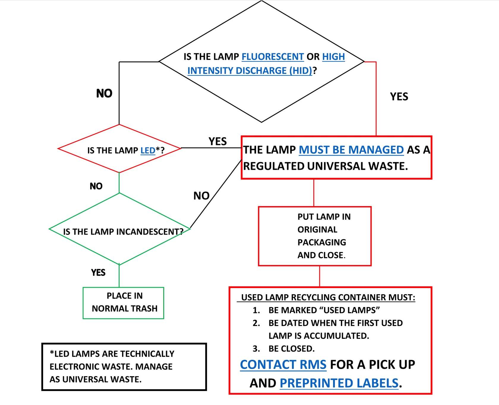
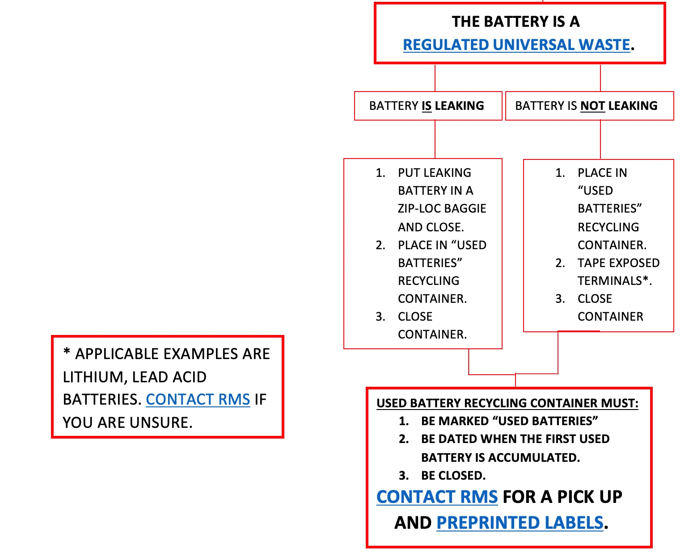

# Technologies

Under construction.

------------------------------------------------------------------------

## Lab

### Termite handling

```{=html}
<!-- feedback from Elijah
You mention that we kill many termites during research at the beginning general section of the lab manual. It may be good to add during this section or come back during a later section (such as learning objectives), that handling and maintaining termites can be much different than the handling in other insect systems. Learning how to work with specific insect groups, and understanding their requirements to survive and thrive when maintaining or using them in experiments is an essential skill. I figured this out when trying to manage a colony of R. flavipes for my personal enjoyment; the colony died likely resulting from desiccation because my colony conditions were not adequate. Some species are highly sensitive to handling mortality and require specific environments to avoid losses of individuals and lab colonies. Understanding how to best manage colonies and handle termites during experiments can help in decreasing handling mortality and ensure success of experiments. 

I would have added this, but I wanted input from you first before I made any significant changes. 
-->
```
### Lab waste

-   Chemicals
    -   [The list of Non-Haz
        Chemicals](https://cws.auburn.edu/shared/content/files/1308/nonhazlist.pdf).
        These can be disposed of in the lab or work area.
    -   Ethanol is counted as hazardous waste. They will be accumulated
        at SAA.
    -   When a container in your SAA is full, [fill out a CHEMATIX waste
        card and affix it to the chemical in SAA, and then submit a
        CHEMATIX pick-up
        worksheet.](https://auburn.bioraft.com/training/Auburn/ManagingWaste_2020_Oct_14/scormcontent/assets/W3GMqscRVD1_Xqea_S9zliRC6HevCnupA-how-20-to-20-submit-20-waste-20-cards-20-in-20-chematix.pdf)
        [Hazardous Waste Container
        Label](https://cws.auburn.edu/shared/files?id=227&filename=SMALL%20HAZARDOUS%20WASTE%20CONTAINER%20LABEL%20(avery%205163).pdf)
    -   Used Oil also goes SAA
-   Autoclave
    -   We sometimes use autoclave to kill termites.
    -   Only use blue or clear autoclave bags with no markings.
-   Universal waste
    -   Lamps should be closed in containers such as boxes or plastic
        bags and labeled. See
        [here](https://cws.auburn.edu/shared/files?id=227&filename=EM-UsedHGLampGuidance.pdf)
        if broken. Call RMS (334-844-4870) immediately after changing
        out lamps for pick-up.
    -   Batteries are accumulated in a container labeled "used
        batteries" and put the start date. Call RMS (334-844-4870) for
        pick-up.
    -   Mercury-Containing Equipment (MCE) should be closed in a
        spill-proof container labeled "Used MCE". Call RMS for pick-up.

{width="50%" height="50%"}
{width="50%" height="50%"}

-   Electronics: call the [Waste Reduction and Recycling
    Department](http://auburn.edu/administration/facilities/organization/operations/campus-services/recycling/)

-   Computer-related items: call [Surplus](https://ba.auburn.edu/)

-   Glass

    -   Broken glass should be stored in clearly marked cardboard boxes,
        plastic jugs, etc.
    -   Lab personnel are responsible for taking broken glass to the
        trash.

------------------------------------------------------------------------

## Field

## Hardware

### Lab PCs

------------------------------------------------------------------------

### Raspberry Pi

Setup for timelasp imaging:

raspberry pi 4 ModelB 4GB RAM, camera module v2.1

setup of raspberry pi (download image file and use balenaEtcher)
[ref](https://raspida.com/install-rasbian-balenaetcher)

install RPi-Cam-Web-Interface
[ref1](https://elinux.org/RPi-Cam-Web-Interface);
[ref2](https://denor.jp/raspberry-pi%E3%81%A7%E6%98%A0%E5%83%8F%E3%82%92%E8%A6%8B%E3%81%AA%E3%81%8C%E3%82%89%E3%82%BF%E3%82%A4%E3%83%A0%E3%83%A9%E3%83%97%E3%82%B9%E6%92%AE%E5%BD%B1)

The Interface's screen resolution is determined by the video settings,
but the resolution when taking photos can be set separately. Therefore,
when taking photos, it is conveninent to set the video to 1 FPS and
match its resolution to that of the photos.

------------------------------------------------------------------------

## Data management practices

### Naming files

Here are some rules when you name files

-   Use "YYMMDD" format when indicating date. This is useful when
    sorting.
    -   👍 : 240718_draft_termite_tunnel.docx
    -   👎 : 071824_draft_termite_tunnel.docx
-   Never use " " to separate content. Use "\_" instead.
    -   👍 : draft_termite_tunnel.docx
    -   👎 : draft termite tunnel.docx
-   The name of the root folder of Microsoft OneDrive has a space (e.g.,
    OneDrive - Auburn University), which makes us crazy. [This
    link](https://blog.jongallant.com/2020/01/onedrive-rename-remove-spaces-from-folder-name/)
    provides a good solution. Here are summary of what we will do.
    1.  Open the command prompt as administrator
    2.  Navigate to the parent folder of your current OneDrive folder
    3.  execute this command: ```mklink /J OneDrive_Auburn "OneDrive - Auburn University"```
    4.  You may modify "OneDrive_Auburn" and "OneDrive - Auburn
        University" as you want
    5.  Now you can access to OneDrive from "OneDrive_Auburn". From now
        on, just open all your files from the junction folder, not the
        OneDrive folder.


### OneDrive

Working data, codes, and manuscripts will be saved in OneDrive. Download
[OneDrive](https://www.microsoft.com/en-us/microsoft-365/onedrive/download)
and sign in as an AU account to OneDrive. Also, see the above to remove
space from the OneDrive root folder.  
I expect working project folders to be structured as follows (example).  

+ OneDrive_Auburn 
  + Projects 
    + mic_ner_tandem_run 
      + draft 
      + analysis 
        + codes 
        + data_raw 
        + data_fmt 
        + output 

where we put draft-related items in draft and analysis-related items in analysis. The entire project folder (here, mic_ner_tandem_run) will be organized by git and github.

### Box

We use Box to store larger datasets and finished projects. Do not put
currently working projects. Apparently, Box causes problems coping with
GitHub and RStudio as of 240906. This will change in the future.

### Git and Github

Git is version control system, used for tracking code changes. Github is
a web service using Git. These are very strong tools to work on coding.
This Lab Manual and Lab Website are created and managed by Github.

1.  Install [Git](https://git-scm.com/downloads) on your PC.
2.  Create a GitHub account [here](https://github.com/)
3.  Install [GitHub Desktop](https://desktop.github.com/download/)

------------------------------------------------------------------------

### HDDs

------------------------------------------------------------------------

## Software

### R and RStudio

Go to [R Project](http://www.r-project.org) Go to
[RStudio](http://www.rstudio.com)

------------------------------------------------------------------------

### Python

Use virtual environment for python.  
**1. What is a Virtual Environment?**  
A virtual environment is a self-contained space that contains a Python installation and its packages. It allows you to create isolated spaces for every single project, each with its own set of dependencies and configurations. This isolation ensures that projects do not interfere with each other.

**2. Why is it Important?**  
Without virtual environments, we will face version conflicts and compatibility issues. Also, tracking the version of python and packages is important for reproducibility. This will make everything easier.

**3. Create virtual environment using Anaconda**  

- Download the [Anaconda Distribution](https://www.anaconda.com/download/success) and install it.
- We need to add Anaconda to PATH during installation process, or manually after that. See [What is PATH?] if you are not familier with PATH.
- Create a new environment with Python 3.7 for example (you can change the version as you want)
  - Open "Anaconda Prompt" or cmd
  - ```conda create -n myenv python=3.7```
  - put any name you like in "myenv". It should reflect project name.
- Activate the new environment
  - ```conda activate myenv```
  - you are now in the virtual environment, and ready to install anything you want.
- Deactivate the environment
  - ```conda deactivate myenv```

### Use Python in Rstudio 

### FFmpeg (Video edits)
FFmpeg is a powerful open-source framework used for handling videos. We use this for basic tasks such as converting, encoding, and decoding.

**How to Install FFmpeg**

Windows

- Got to [FFmpeg official website](https://www.ffmpeg.org/)
- Download the latest static build for Windows.
- Once downloaded, extract the ZIP file to a desired location on your computer. recommended locations: "C:/Program Files/ffmpeg". (this keeps it in line with other program installations)
- Set up FFmpeg PATH (see [What is PATH?] if you are not familier)
- Open Command Prompt and type ffmpeg to check if it’s installed correctly. 

Mac

- Install Homebrew (if not installed):
  - Open Terminal and run: ```/bin/bash -c "$(curl -fsSL https://raw.githubusercontent.com/Homebrew/install/HEAD/install.sh)" ```
- Install FFmpeg:
  -   ```brew install ffmpeg ```

[Sample codes](https://github.com/nobuaki-mzmt/memo/blob/main/cmd.cmd). We can always ask ChatGPT that e.g., "write a code to use ffmpeg to change the resolution 640 in width in windows PC". They provide "ffmpeg -i input.mp4 -vf scale=640:-1 -c:a copy output.mp4"


### Tracking software

-   [UMATracker](https://ymnk13.github.io/UMATracker/)
-   [SLEAP](https://sleap.ai/)

### OpenCV

1.  Install OpenCV (<https://github.com/opencv/opencv/releases>) (5M:
    4.3.0 6/24/2020)
2.  Copy a directory "opencv" to "C:"
3.  Add the following to Path\

-   C:\opencv\build\bin
-   C:\opencv\build\x64\vc15\bin

4.  Create new environmental variable

-   name: OPENCV_DIR
-   variable: C:\opencv\build

### VPN

### Zotero (literature management)
Zotero is a free, open-source reference manager designed to help users collect, organize, cite, and share research. Zotero could be much more convienient by using following plugins: Zotfile (handling PDF attachment well) and Zutilo (Batch editing).


------------------------------------------------------------------------

## Writing

-   Our paper will appear in [these
    journals](https://docs.google.com/spreadsheets/d/1tNzj1UMuvO9vShVRI0QanOSFvRSSd8Q5cm1ndOqWjYg/edit?gid=1450194090#gid=1450194090).
-   Rating review process of each journal: [SciRev](https://scirev.org/)

## Notes

### What is PATH?
The ```PATH``` is an environment variable in your operating system that tells the system where to look for executable files (e.g., FFmpeg, imagemagick, anaconda, opencv) when you run commands in the Command Prompt or terminal.  
For example, by adding FFmpeg's bin directory to the ```PATH```, you enable the system to find and run FFmpeg from anywhere, without needing to navigate to its folder every time. You can just type ```ffmpeg``` in the Command Prompt and it will work. Without adding it to the PATH, you would need to navigate to the folder where FFmpeg is installed and run the command from there.
How to add to PATH (FFmpeg for example):  

- Open "Edit the system environment variables" in the control panels. (you can open it just typeing path in the search bar after pushing start bottum)
- In the "Edit Environment Variable" window, click "New" and paste the path to the bin folder inside your extracted FFmpeg folder (e.g., C:/Program Files/ffmpeg/bin).
- Click "OK" on all windows to apply the changes.

### I cannot play a video on my PC
**1. Codec**  
A codec (short for compressor-decompressor) is a tool that compresses and decompresses digital media files, such as videos and audio. There are various methods of codecs, and due to this variation, some videos may not be able to play in your PC.  
**Examples of Codecs**  

- H.264 (video)
  - This is a widely used codec.

- HEVC (H.265) (video):
  - Compresses video files even more efficiently than H.264, often with similar or better quality.
  - However, windows PC stops supporting this codec since Windows 10. This is frustrating. We need to buy the extension from the [Miscrosoft Store](https://apps.microsoft.com/detail/9nmzlz57r3t7?hl=en-US&gl=US). This is just $0.99. I don't understand why windows stop providing this as default. Most problems happen due to this.

**Change the codec of your video**  
This can be done using [FFmpeg (Video edits)] very easily.  
```ffmpeg -i input.mov -c:v libx264 -c:a aac output.mp4```  
This command specifies H.264 for video and AAC for audio.

```ffmpeg -i input.mov -c:v libx265 -c:a aac output.mp4```  
This command specifies H.265 for video and AAC for audio.

**Investigate the codec of your video**  
```ffmpeg -i video.mp4```

**2. Pixel format**  
H.265 (HEVC) is more efficient at compressing video, especially at higher bit depths (e.g., 10-bit), while H.264 might not support 10-bit color properly or is not configured to handle it.  
When we convert h265 to h264 and encounter the error, changing color depth could solve the problem.  
```ffmpeg -i Kalotermes.MOV -vf scale=640:-1 -pix_fmt yuv420p -c:v libx264 Kalotermes_h264.mp4```  
```-pix_fmt yuv420p```: Converts the video to 8-bit color depth, which is more compatible with H.264 encoding and standard media players.
