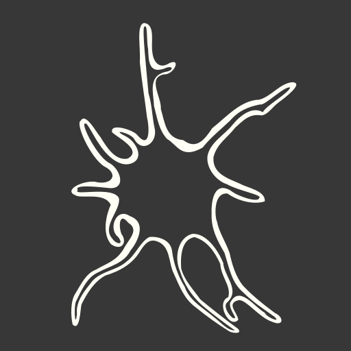

--- 
title: "Mizumoto Lab Manual"
author: 'Nobuaki Mizumoto'
date: "`r Sys.Date()`"
site: bookdown::bookdown_site
documentclass: book
bibliography:
- book.bib
- packages.bib
description: This is the lab manual for the Mizumoto Lab at Auburn University.
github-repo: "nobuaki-mzmt/mizumoto-lab-manual"
---

# Mizumoto Lab Manual
 
{width=50% height=50%}
 
## Welcome

Welcome to the Mizumoto Lab at Auburn! 

**We are so existed to have you join us!** This manual aims to outline our goals, expectations, resources, and unique culture at our Lab. During your time here, we hope you will enjoy the research frontier to study the complex behavior of termites and scientific activities as a whole.Our collective aim is for everyone to leave the lab enriched with new skills, perspectives, and a network of colleagues and friends. We encourage you to leave your positive mark on the lab and make meaningful contributions. Like individuals, a lab evolves over time, shaped by each member's input. We eagerly anticipate the impact you will make during your stay with us.  

Mizumoto Lab started Jan 2024. The lab PI is Nobuaki Mizumoto (NM here after). You can reach me in person (Funchess 376A) or via email (nzm0095@auburn.edu). 

----------

## Mission Statement

Mizumoto lab aims to trace the evolution of collective behavior in termites. We will identify behavioral rules underlying termite communications and relate behavioral diversity with social structures and pest status. We believe behavioral findings come from a new perspective and a small trick of experiments, not solely from advanced technology. Thus, we strive to create a constructive environment, turning daily discussions into exciting research ideas.  
  
Also, one of our missions is to provide a comprehensive understanding of termite diversity. Knowledge on termites are highly biased as a destructive structural pest. However, among > 3,000 termite species in this world, only a handful of species are counted as destructive pests. We want to reveal why some termites are pests and why others are not. We will contribute to society by sharing the inclusive pictures of our tiny creatures.

----------

## Notes
Our lab manual is designed to be always under construction. Please input your feedback. I am thrived to create a better environments for all of the lab members, which should vary dynamically according to time.  
  
I you are new to the lab, please have read and understand these lab policies (section 1-4), and then submit the [form]() to NM.  
  
This lab manual was inspired by several others, and borrows heavily from them (e.g., 
[bablab](https://github.com/bablab/lab_manual), [marekborowiec-lab](https://github.com/marekborowiec/lab-wiki.wiki.git), 
and 
[Ritchey-lab](https://github.com/memobc/memolab-manual).  
    
*This lab manual is licensed under a [Creative Commons Attribution - NonCommercial 4.0 International License](https://creativecommons.org/licenses/by-nc/4.0/). If you want to make your own manual for a lab, or any other purpose, please feel free to take any ideas and inspiration for this one (and cite us), as well as from the others we have used when making this (and cite them).*

